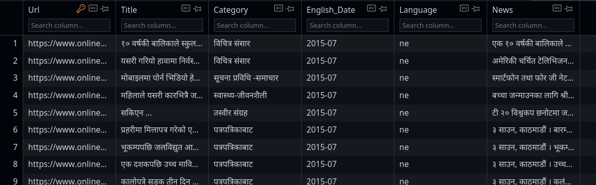

# Large Nepali Text Dataset

I am thrilled to announce that I am open-sourcing a text database that I've been building for some time now. By open-sourcing this database, I hope to make it easier for researchers, academics, and anyone else who is interested in text analysis to access and analyze a wide range of text data.
In addition to the text itself, the database a news databaset which includes metadata such as publication date, category, language, and URL. This metadata makes it easier to search and filter text data based on specific criteria, such as the date range or the category. I believe that open-sourcing this text database will be a valuable resource for anyone who is interested in text analysis. I hope that it will encourage others to contribute to the project and help make it an even more comprehensive and useful resource for everyone. Let's work together to create a more accessible and comprehensive resource for text analysis.

## Nepali News Dataset: 
Link :  https://www.kaggle.com/datasets/rajanghimire/person-segmentation <br>
Format: ```SQLite``` <br>
Size : ```x GB```
* * * 
This dataset contains news data scraped from popular Nepali news sites such as Ratopati, Setopati, Oninekhabar, and Gorkhapatra. The data contains metadata such as publication date, category, language, and URL.This dataset contains news data scraped from popular Nepali news sites such as Ratopati, Setopati, Oninekhabar, and Gorkhapatra. The data contains metadata such as publication date, category, language, and URL.

 The data is stored in SQLite database and you can use the following script to convert SQLite database to CSV. 
```python 
import sqlite3
import pandas as pd

conn = sqlite3.connect("database.db", isolation_level=None,
                       detect_types=sqlite3.PARSE_COLNAMES)
db_df = pd.read_sql_query("SELECT * FROM news_table", conn)
db_df.to_csv('database.csv', index=False)

```


## Neplai Preprocessed Text: 
* * *
This dataset contains preprocessed Nepali raw text scraped from different nepali sources. (Mostly old news and articles form Wikipedia)

Link 1 :  https://www.kaggle.com/datasets/rajanghimire/375-gb <br>

Link 2  :  https://www.kaggle.com/datasets/rajanghimire/nepali-raw-text-data-batch1<br>

Link 3 :  https://www.kaggle.com/datasets/rajanghimire/nepali-raw-text-data-batch2 <br>
Format: ```.txt``` <br>
Size : ```6.86 GB```